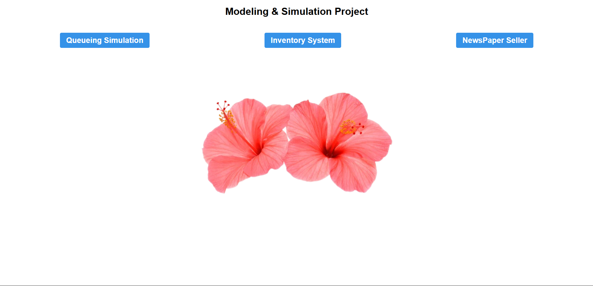
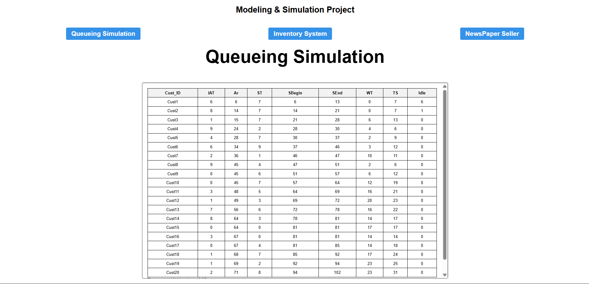
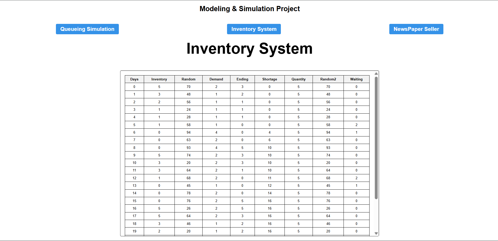
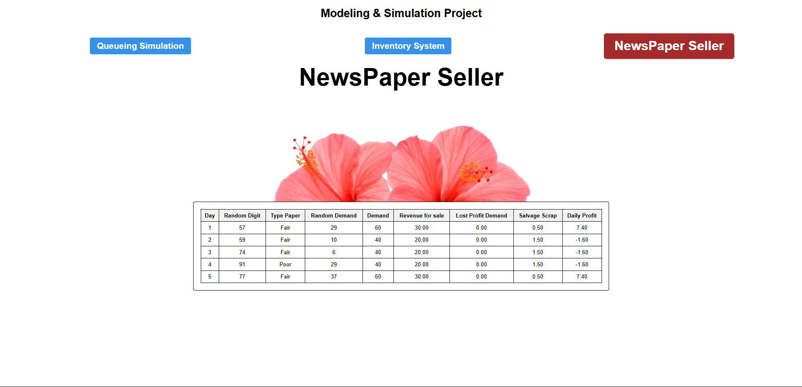

<div align="center">

# 📊 Modeling and Simulation Project

### Interactive Web-Based Modeling & Simulation System


</div>

---

## 📖 Overview

This project was developed as part of the **Modeling & Simulation** course. It provides interactive simulations for several real-world systems using HTML, CSS, and JavaScript.

---

## ✨ Features

- 🚶 Queueing Simulation
- 📦 Inventory System Simulation
- 📰 Newspaper Seller Simulation
- 🎲 Randomized simulation results
- 💻 Interactive web interface

---

## 🛠 Technologies

- HTML5
- CSS3
- JavaScript

---

## 🚀 Getting Started

1. Clone the repository

```bash
git clone https://github.com/USERNAME/Modeling-and-Simulation-Project.git
```

2. Open

```
Modeling.html
```

3. Run in your browser.

---

## 📷 Screenshots

### Home Page



### Queue Simulation



### Inventory Simulation



### Newspaper Seller



---

## 👥 Team Members

- [Amr Sadek Mostafa](https://github.com/Amr-Sadek)
- [Ahmed Hossameldin Abdelrauf](https://github.com/Eng-Ahmed-HossamEldin)
- [Ahmed Mohamed Ahmed Eldemiry](https://github.com/AhmedMohamedAhmedEldemiry)
- [Mostafa Tarek Ibrahim Ibrahim]

---

## 🎓 Academic Information

- **Course:** Modeling & Simulation

---

⭐ If you like this project, consider giving it a star.
